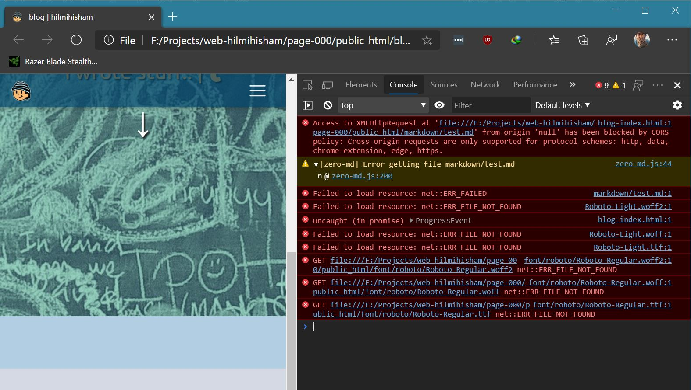

# 001: #text page build process.

Okay, Movement Control Order (MCO) has been going on for i-don't-know-the-day-count-anymore days here in Malaysia, and while I'm still need to do my daily job everyday from home, I found this WFH shenanigans sometimes got me some free time post-office hours. I said "some" 'coz work has been real busy, everything seems very much on fire, but that's a story for another day.. but hey, getting some free time is much better than none back when all these MCO and WFH hasn't been implemented yet before, so it's all okay, I guess haha..

> *it's Day 31 of MCO now in Malaysia, I've check. (We've started this back in 18 March 2020)*

Back to the main topic - I've got this idea to back on writing after reading some blog post on ideas of what to do with all these free time that I have. Albeit it wasn't that much, but I guess it's better to fill it up with some activity rather than just melt myself on the couch and browsing tons of TV channels that I'm never bother to watch in the first place anyway. They suggested cleaning as well, but maybe not for me haha.. and the blog is aimed towards programmer, so they suggested something along the line of making a programming blog, so I guess I can try it, since I got this project on my website going.

..and the said project is this: **a little project to get my good 'ol static HTML website to churn out blogpost from *Markdown-formatted* text file**.

## Project background

*this is my first time writing this kinda blog post, so some of my lingo might not be up to the standard, and 'coz I also still experimenting with the stacks that I wanna use to build my webpage*

First of all, this is all just a *static HTML files*, so we have all the **HTML + CSS + JS** goodness with folder structure to keep all things organized as best as I can. I build up all the structure design of this webpage on HTML with Bootstrap, get all the detail things (color, fonts, etc etc) into CSS, and JS for some effects (the down arrow at the top of the page is one of them).

Next, I packaged all of these into a **WAR file**, and had it **deployed into Heroku**. I might be able to deploy this better onto a personal server or some sort, manage everything with Tomcat for example, and have better detail control like that, but money is one of the problem so I sort of managing with free Heroku account for now..

As for this text, it's *written using Visual Studio Code locally*, and saved as **.md Markdown format**. Nothing fancy for now, just whatever tools that can make this works quick and easily for now.

OK, onto the technical bits!

## Technical bits

OK, technical bits. First off, to get this Markdown formatted text rendered as HTML, I imported [**zero-md**](https://zerodevx.github.io/zero-md/) web component into my website. You can read more about the details of this web component on their website [here](https://zerodevx.github.io/zero-md/), along with all sorts of API that you can use to make better use of it, but I just gonna show off how I implemented it simply into my website here.

Just simply folloy the instruction over there to get it started. Need to import two things first into the header of the HTML file.

```
<head>
    ...

    <!-- markdown to HTML -->
    <script src="https://cdn.jsdelivr.net/npm/@webcomponents/webcomponentsjs@2.2.10/webcomponents-loader.min.js"></script>
    <script type="module" src="https://cdn.jsdelivr.net/gh/zerodevx/zero-md@1/src/zero-md.min.js"></script>

    ...
</head>
```

..and as what the guide said, profit!

Haha, if those two component has been imported correctly into your HTML page, then the rest is just using `<zero-md>` tagging properly, and it will simply process your Markdown text to be displayed properly in HTML. The code is something like below:

```
<body>
    ...

    <zero-md src="markdown/test.md"></zero-md>

    ...
</body>
```

Yup, simple as that. Whip out their `<zero-md>` tag, specify your Markdown file location in `src` attributes, and profit! In my case, I have all these folder structure for all the things for this webpage, so `markdown` is the relative path to the folder that contains my `test.md` file inside. 

## Anything to highlight?

Mind you one thing, if you're on simple static HTML page and just double-click your HTML file to locally open in a browser to see whether all was good or upside-down, testing was not really possible like this. Apologies for my bad technical jargon here, but apparently, it cannot pull out locally sourced file. So, if you specify the `src` just like above for local file, nothing will be displayed as the browser console recorded something like this.


Notice the two error recorded at the top of `Console` tab there, and the light-blue box on the page was the place the markdown file should have been shown up.

Well, given some time for simple googling, it might be because of some setting or whatever, but 'coz of the lack of time, I didn't bother about it for now. Since I've tested the same exact code, but referencing `src` attribute to some Markdown file I've got in my github (online file, basically), and it works as intended, so I've decided to move on and simply deployed the finished product into my Heroku.

*Yes, I'm working full-time as a junior programmer now, and simply deploying code without fully testing it is never a good thing, I know. But lack of time, and it wasn't a mission critical thing - it's just my personal web - just forgive me this time ya. Huhu..*

## Yup, that's it

I dunno why this post is a bit long, but that's basically it. Simple as that, and you'll be able to use Markdown as a base for your blog post and displayed it on your web as HTML.

I think Markdown format is the better choice for blog post - simple syntax here and there and all the text is formatted as how you wanted in a blog post - bold, italic, blockquote, links, etc etc.. So, that's why I wanna use it as the base for my blog page, and had it hosted on my website.

I probably can extend this project further. My thoughts currently is along the line of having 1 page for me to create and update a blog post right from my website, so that way I don't have to type this file locally and need to do deployment on my website every time I want to add a post. And to further extend that idea, to maybe save the text in some sort of database, and just pull the text dynamically rather that creating 1 static HTML each time to pull 1 blog post. 

But, that's probably for another free time that I might have later.

Dunno who's reading this, but hopefully it'll benefit you guys.

`hilmihisham - 20200417, 0141hrs`