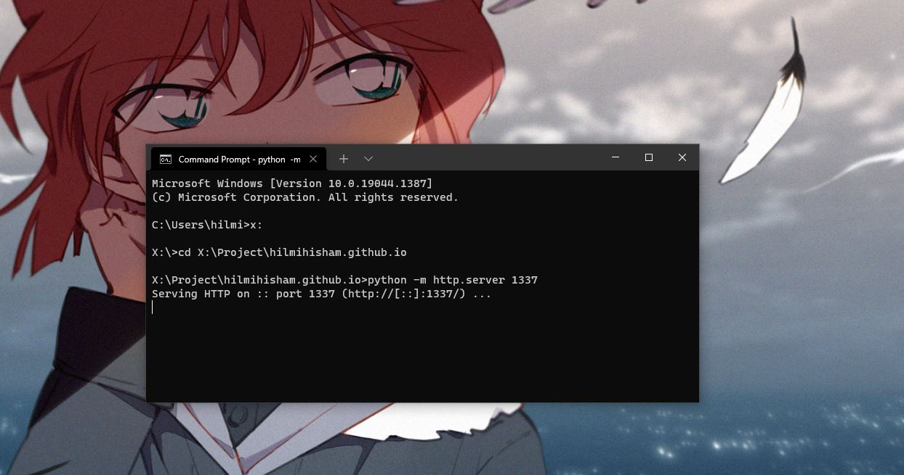

# 002: Import HTML from other HTML file, and solving Cross Origin Request on local testing.

I'm so happy to solve this (rather simple problem actually, but oh well) that I immediately decided to document this here, afraid that I might forget the whole process afterwards. While building this hilmihisham.com webpage, I have a thought of simplifying the HTML code that I have a bit. And that's how the thought of importing HTML comes to mind.

Well, in my day work, we're using Struts, JSP, all that sort of framework and stuff. So, having used to create the page using JSP where I can just import a bunch of pages together, I sort of thought maybe I could do the same for my simple static HTML page. I mean, the whole carousel thingy on my homepage already took up 155 lines, and that *Project (Real) Car* haven't really done yet. If I were to continue putting everything into just 1 HTML file, the whole thing will be just massive once my homepage is properly done later on.

So I started researching on this, and quickly understand that HTML doesn't really have a native way of doing this. So we need to do it in some other way, and I found a relatively simple solution of using JS script (yes, thank you w3school haha).

## Importing HTML: Technical bits

First, create a JS script for `includeHTML()` function as below. This is the same snippet of code that I referenced from [How To Include HTML (w3schools.com)](https://www.w3schools.com/howto/howto_html_include.asp). For details on the code, it's all have been commented nicely there.

```js
function includeHTML() {
    var z, i, elmnt, file, xhttp;

    // loop through a collection of ALL html elements
    z = document.getElementsByTagName("*");

    for (i = 0; i < z.length; i++) {
        elmnt = z[i];

        // search for element with a certain attributes
        file = elmnt.getAttribute("w3-include-html");

        if (file) {
            // make an HTTP request using the attribute value as the file name
            xhttp = new XMLHttpRequest();
            xhttp.onreadystatechange = function () {
                if (this.readyState == 4) {
                    if (this.status == 200) {
                        elmnt.innerHTML = this.responseText;
                    }
                    if (this.status == 404) {
                        elmnt.innerHTML = "Page not found";
                    }

                    // remove the attribute, and call this function once more
                    elmnt.removeAttribute("w3-include-html");
                    includeHTML();
                }
            }

            xhttp.open("GET", file, true);
            xhttp.send();

            return;
        }
    }
};
```

Once the above JS script has been created, we can now import it into the HTML file.

```html
<head>
    ...
    <script src="js/html-include.js"></script>
    ...
</head>
```

Notice that there's a line `elmnt.getAttribute("w3-include-html");` in the JS script, this is telling that we're looking for attribute named `w3-include-html` in the HTML file to be replaced with another HTML file that we're importing from, which is specified within this attribute. In HTML body, it goes like this:

```html
<body>
    ...
    <div w3-include-html="projectRealCar-cardCarousel.html"></div> 
    ...
</body>
```

Finally, we need to call that `includeHTML()` function from our JS script. In my case, I put this call right at the end of the page, just before the `body` closing tag.

```html
<body>
    ...
    <script>includeHTML();</script>
</body>
```

## Solving Cross Origin Request error on local

The above code is good and all, but it won't be viewable if we just straight double-click on the finished HTML file to open it on web browser. Since the HTML file is trying to call another local file, most browser will trigger `Access to XMLHttpRequest from origin 'null' has been blocked by CORS policy`. 

I got this same error when I first experimenting with zero-md web component to create the base of this blog page, but since I just wanna finish the experiment fast, I just don't bother with it at that time. 

I don't understand much on the error, but enough to know that it's something regarding of security. **"Many web browsers are programed to watch for cross site attacks, and will block requests. You don't want just anyone being able to read your hard drive from your web browser."** as what I understand [from this post in Stack Overflow](https://stackoverflow.com/questions/20041656/xmlhttprequest-cannot-load-file-cross-origin-requests-are-only-supported-for-ht/20578692#20578692) where I got my solution for this as well, and that's enough for now. So as what they suggest over there, let's **run a local server**.

1. Download and install Python (at the time of writing, I'm using Python 3.10.1)

2. Ensure Python directory have been inserted into path. On cmd, you can just call `path` to see what is currently registered there.

3. Open cmd FROM the folder where you wanna serve the files.

4. Start Python server: `python -m http.server 1337` where 1337 is the port number. You can assign any number, or not assigning anything and it will be defaulted to 8000.

5. That's it. Server is running and you can simply go to `http://localhost:1337/` from your web browser.



..looks something like the above on my Terminal to run the local server.

We could also create a proper local server like Apache or something, but for my usage, Python http.server is good enough for now. After all, I'm only having a static HTML, all of which is hosted on github pages as-is.

---

So, that's it. Very happy to get the import HTML function working, and solving past error at the same time. I documented this for my own benefits, in case I forgot how to bring up the local server, but hopefully anyone that stumbled upon this page could benefits from it as well.

Happy coding, and yea, happy christmas as well!

`hilmihisham - 20211224, 2242hrs`
